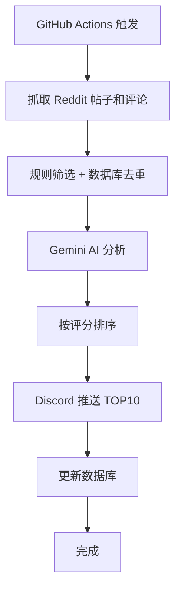

# TOEFL Reddit Scout

自动化监控和分析 Reddit 的 TOEFL 相关社区（r/TOEFL, r/ToeflAdvice），每天抓取优质帖子和评论，使用 Google Gemini AI 分析并筛选出最佳回复机会，通过 Discord 推送通知。

## 功能特性

- ✅ **双轨分析**：分别识别优质帖子和评论的回复机会
- ✅ **智能评分**：使用 Gemini AI 评估内容质量和回复价值
- ✅ **优化抓取**：Hot + Rising + Top + New 四种策略混合
- ✅ **轻量去重**：SQLite 记录已推送帖子，3 天 TTL 自动清理
- ✅ **零凭证**：使用 Reddit 公共 JSON API，无需任何 API 凭证
- ✅ **自动化运行**：GitHub Actions / Railway 定时执行
- ✅ **Discord 推送**：结构化的 TOP10 帖子 + TOP10 评论报告
- ✅ **低成本**：Gemini 1.5 Flash 模型，月成本约 $0.05-0.15

## 项目结构

```
toefl_scouts/
├── src/
│   ├── __init__.py
│   ├── config.py              # 配置管理
│   ├── reddit_scraper.py      # Reddit 数据抓取
│   ├── content_analyzer.py    # Gemini 内容分析
│   ├── discord_notifier.py    # Discord 消息推送
│   └── database.py            # SQLite 数据库
├── data/
│   └── pushed_items.db        # SQLite 数据库（已推送记录）
├── .github/
│   └── workflows/
│       └── daily_scout.yml    # GitHub Actions 配置
├── config.yaml                # 配置文件
├── pyproject.toml             # 项目依赖配置（uv）
├── main.py                    # 主入口脚本
├── .env.example               # 环境变量示例
├── .gitignore
└── README.md
```

## 技术栈

本项目使用 **[uv](https://github.com/astral-sh/uv)** 进行 Python 包管理：
- 🚀 极快的依赖安装速度（比 pip 快 10-100 倍）
- 📦 统一的项目管理（pyproject.toml）
- 🔒 确定性的依赖解析（自动生成 uv.lock）
- 🎯 无需虚拟环境管理（uv 自动处理）

> 📖 详细的 uv 使用说明请查看 [UV_GUIDE.md](UV_GUIDE.md)

## 快速开始

### 1. 准备 API 凭证

#### Reddit (无需任何凭证!)

本项目使用 Reddit 的公共 JSON API，**无需注册 Reddit App 或获取任何凭证**。

#### Google Gemini API

1. 访问 https://ai.google.dev/
2. 点击 "Get API Key"
3. 创建或选择项目
4. 复制 API Key

#### Discord Webhook

1. 打开 Discord 服务器设置
2. 进入 "集成" → "Webhooks"
3. 创建新 Webhook
4. 复制 Webhook URL

### 2. 本地测试

```bash
# 克隆仓库
cd toefl_scouts

# 安装 uv（如果还没安装）
# macOS/Linux:
curl -LsSf https://astral.sh/uv/install.sh | sh
# Windows:
# powershell -c "irm https://astral.sh/uv/install.ps1 | iex"

# 安装依赖
uv sync

# 创建 .env 文件
cp .env.example .env

# 编辑 .env 文件，填入你的 API 凭证
nano .env

# 运行脚本
uv run main.py
```

### 3. 部署到 GitHub Actions

1. 将代码推送到 GitHub 仓库

```bash
git init
git add .
git commit -m "Initial commit: TOEFL Reddit Scout"
git remote add origin https://github.com/your-username/automated-workflows.git
git push -u origin main
```

2. 在 GitHub 仓库中配置 Secrets：
   - 进入 `Settings` → `Secrets and variables` → `Actions`
   - 添加以下 secrets：
     - `GEMINI_API_KEY`
     - `DISCORD_WEBHOOK_URL`

3. 启用 GitHub Actions：
   - 进入 `Actions` 标签
   - 启用工作流
   - 工作流将每天北京时间 10:00 AM 自动运行

4. 手动触发测试：
   - 进入 `Actions` → `Daily TOEFL Scout`
   - 点击 "Run workflow"

## 配置说明

### config.yaml

```yaml
reddit:
  subreddits:
    - TOEFL
    - ToeflAdvice
  post_limit: 50          # 每个 subreddit 抓取的帖子数量
  time_filter: day        # 时间过滤器

gemini:
  model: gemini-1.5-flash # Gemini 模型
  max_tokens: 2048        # 最大生成 token 数
  temperature: 0.3        # 生成温度（越低越保守）

filters:
  min_upvotes: 5          # 帖子最低点赞数
  min_comments: 2         # 帖子最低评论数
  min_comment_score: 3    # 评论最低分数
  keywords:               # 关键词过滤
    - help
    - advice
    - improve
    # ...

output:
  top_n: 10               # 输出 TOP N 数量
```

## 工作流程



## 输出示例

Discord 推送消息格式：

```
━━━━━━━━━━━━━━━━━━━━━━━
📊 TOEFL Reddit 每日机会报告
📅 2026-02-05
━━━━━━━━━━━━━━━━━━━━━━━

═══════════════════════
📌 TOP 10 优质帖子
═══════════════════════

【#1】⭐ 评分: 9.2/10
📝 托福阅读如何从20分提升到25+？
🏷️ 主题: Reading
🔥 热度: 156↑, 23💬
⏰ 发帖: 3小时前
🎯 契合度: high

💡 回复策略:
1. 强调TPO真题练习的重要性
2. 分享错题分析方法
3. 推荐 TOEFLAIR 的阅读分析功能
4. 提供具体的学习计划建议

🔗 [直达帖子](https://reddit.com/...)

---

═══════════════════════
💬 TOP 10 优质评论
═══════════════════════

【#1】⭐ 评分: 8.7/10
📍 原帖: "托福口语Task 2总是卡壳怎么办？"
💬 评论: "我当时也有这个问题，后来发现..."
🔥 热度: 45↑
⏰ 评论: 5小时前
🎯 契合度: high

➕ 回复机会: supplement
💭 原因: 评论提供了个人经验但缺少系统性方法

💡 回复要点:
1. 认可原评论的经验分享
2. 补充结构化的练习方法
3. 强调录音回听的重要性
4. 介绍 TOEFLAIR 的口语评估功能

🔗 [直达评论](https://reddit.com/...)
```

## 成本说明

基于每天运行一次的成本估算：

| 项目 | 说明 | 成本 |
|------|------|------|
| Reddit JSON API | 免费，无需凭证 | $0 |
| Gemini 1.5 Flash | ~65条内容/天 | $0.001-0.003/天 |
| Discord Webhook | 免费 | $0 |
| GitHub Actions | 2000分钟/月免费 | $0 |
| **总计** | | **$0.03-0.09/月** |

## 故障排查

### 常见问题

1. **Reddit 请求失败**
   - 检查网络连接是否正常
   - 确认 `REDDIT_USERNAME` 配置正确
   - Reddit 可能有临时的速率限制，稍后重试

2. **Gemini API 配额超限**
   - 检查 API Key 是否有效
   - 查看 Google AI Studio 的配额使用情况

3. **Discord 消息未发送**
   - 验证 Webhook URL 是否正确
   - 检查 Discord 服务器权限

4. **数据库错误**
   - 删除 `data/processed_posts.db` 重新初始化
   - 检查文件写入权限

### 查看日志

**本地运行：**
```bash
# 查看实时日志
python main.py

# 查看日志文件
cat toefl_scout.log
```

**GitHub Actions：**
- 进入 `Actions` 标签
- 点击最近的工作流运行
- 查看 "Run TOEFL Scout" 步骤的日志

## 高级配置

### 修改运行时间

编辑 `.github/workflows/daily_scout.yml`：

```yaml
on:
  schedule:
    # 修改 cron 表达式
    # 格式: 分 时 日 月 周
    - cron: '0 2 * * *'  # 每天 2:00 AM UTC
```

### 添加更多 subreddits

编辑 `config.yaml`：

```yaml
reddit:
  subreddits:
    - TOEFL
    - ToeflAdvice
    - GRE           # 新增
    - IELTS         # 新增
```

### 调整筛选条件

编辑 `config.yaml`：

```yaml
filters:
  min_upvotes: 10        # 提高阈值
  min_comments: 5        # 提高阈值
  min_comment_score: 5   # 提高阈值
```

## 数据统计

查看历史统计数据：

```python
from src.database import Database
from src.config import Config

config = Config()
db = Database(config.database_path)

# 查看最近 30 天统计
stats = db.get_statistics(days=30)
print(stats)
```

## 贡献指南

欢迎贡献！请遵循以下步骤：

1. Fork 仓库
2. 创建功能分支 (`git checkout -b feature/amazing-feature`)
3. 提交更改 (`git commit -m 'Add amazing feature'`)
4. 推送到分支 (`git push origin feature/amazing-feature`)
5. 创建 Pull Request

## 许可证

MIT License

## 免责声明

- 本工具仅用于合法的社区参与和营销目的
- 请遵守 Reddit 的使用条款和社区规则
- 避免垃圾信息和过度营销
- 提供真实有价值的建议，产品推广应适度自然

## 联系方式

- 产品：[TOEFLAIR](https://toeflair.com)
- 问题反馈：GitHub Issues

---

⭐ 如果这个项目对你有帮助，请给个 Star！
